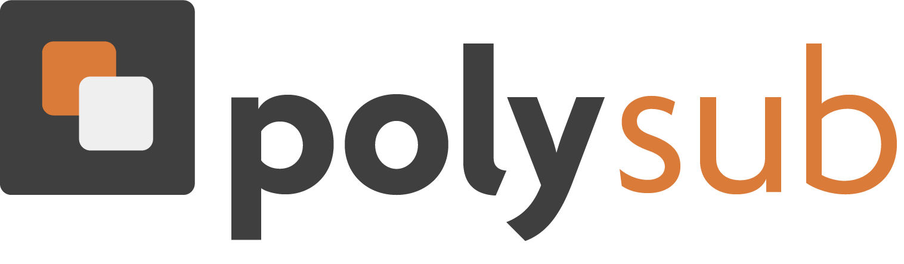

<div align="center">
  
</div>
<br>
<br>
<div align="center">
PolySub is a simple yet powerful GUI-based application that allows you to generate and translate subtitles for any video content. The application leverages the power of the state-of-the-art `SubsAI` module, using machine learning to perform transcription and translation.
</div>
<br>

## Features

- Transcribes and generates subtitles from video files in various formats (e.g., `.mp4`, `.mkv`, `.avi`, `.mov`, `.flv`, `.wmv`)
- Translates generated subtitles from one language to another
- Option to save translated subtitles in a custom output directory

## Prerequisites

- Python 3.6 or later
- Python packages: `os`, `tkinter`, `threading`, `customtkinter`, `subsai`


## Installation

To install this application, you can clone the repository and run the script:

```bash
git clone https://github.com/BedirT/PolySub
cd PolySub
pip install -r requirements.txt
python main.py
```

## Usage

After starting the application:

1. Click on "Select Video Files" to choose one or multiple video files you want to process.
2. Choose the input language (the language the video content is in).
3. Choose the output language (the language you want the subtitles translated to).
4. (Optional) Click on "Select Output File Location" to choose a custom directory to save the translated subtitle files. If you skip this step, the subtitle files will be saved in the same directory as the video files.
5. Click on "Start Process" to start the transcription and translation process.

The progress of the process will be displayed on the progress bar and in the status label, and detailed logs will be shown in the log text box.

## Contributing

Contributions are welcome! Please read our [Contributing Guide](CONTRIBUTING.md) for more information.

## License

This project is licensed under the terms of the MIT license. See the [LICENSE](LICENSE.md) file.

---

## Support

For any questions or issues, please refer to our [Issue Tracker](https://github.com/BedirT/PolySub/issues) or contact us directly.

---

Feel free to use this README.md as a template for your project and replace "yourname", "yourrepo", and "yourproject" with the appropriate values.
